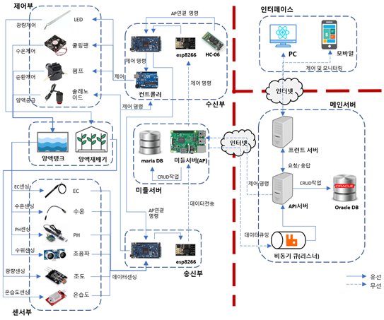
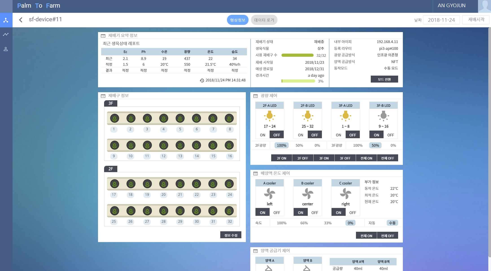
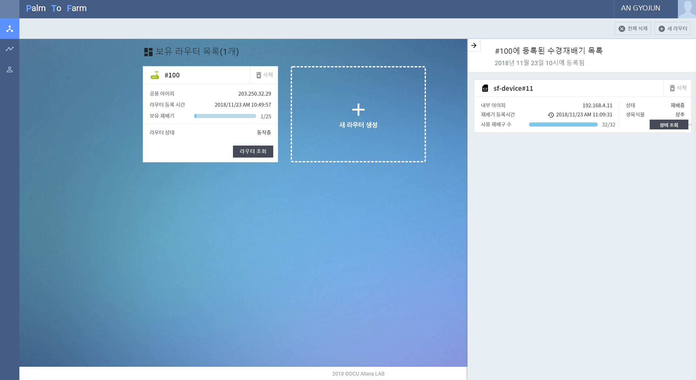
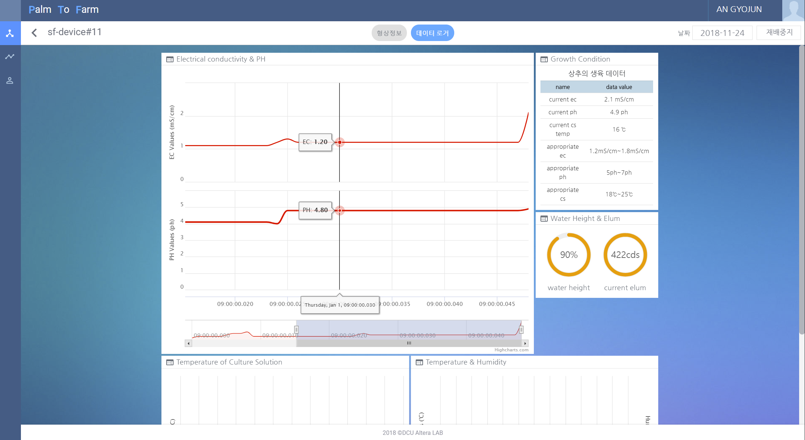
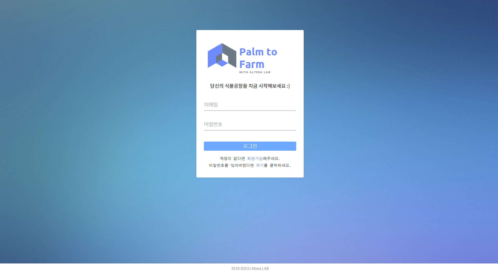
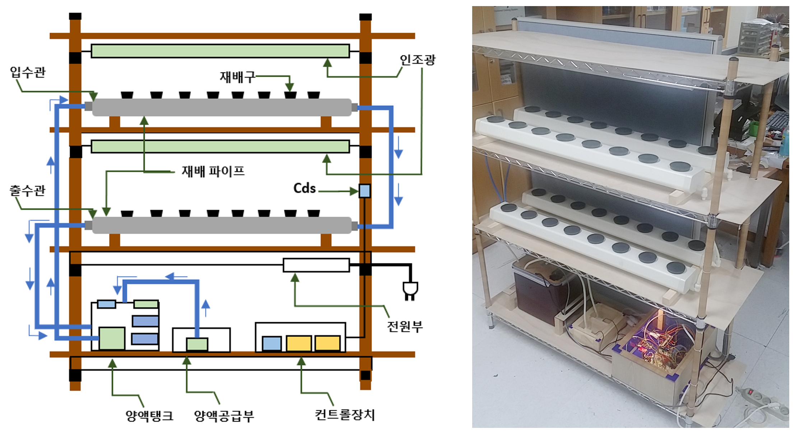
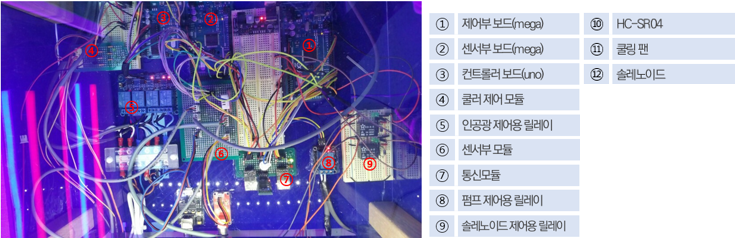
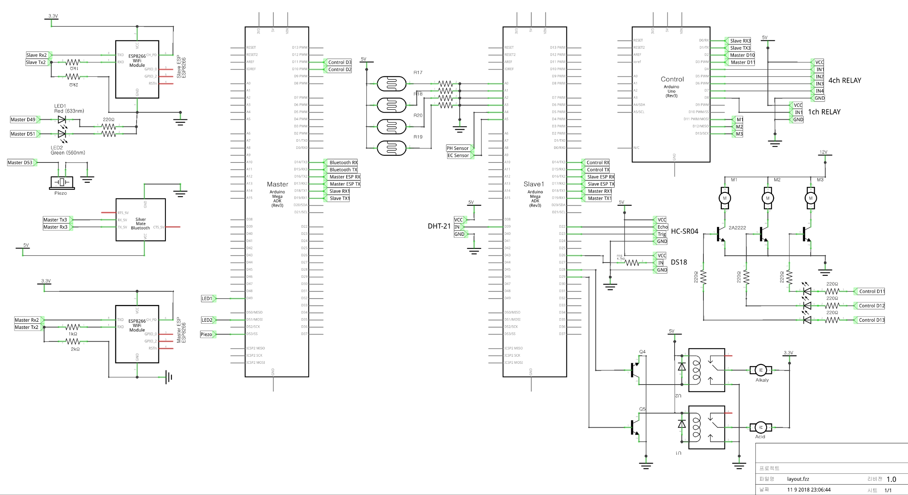

# Palm to Farm
             

Palm to Farm is a system that allows you to build a lightweight, flexible smart farm. The system is largely divided into four components: API server, Smart Farm Manager web app, gateway, and grower. Farmers who want to build smart farms can expand or reduce their growers by the number they want.

This project was carried out for a total of eight months from February to September 2018 and won the **grand prize** at the **16th Embedded Software Competition**.

If you want, it is possible to check the details of this project through demo video and document.

- :yt: **[demo video](https://youtu.be/UkNaeAGOSR0)**
- :memo: **[detailed document](https://drive.google.com/file/d/1GS8nO6k64G959dgILUKcfnk7UEk-LYk3/view?usp=sharing)**

## Repository Hierarchy & Technical Stack
- **[API server](https://github.com/DCU-ICSLab/palm-to-farm/tree/master/ProjectPurple/Web/BackEnd)** : Java, Spring, Mybatis, Oracle11g
- **[Gateway](https://github.com/DCU-ICSLab/palm-to-farm/tree/master/ProjectPurple/Middle)** : PHP, MariaDB, RPI 3B+
- **[Plant Grower Device](https://github.com/DCU-ICSLab/palm-to-farm/tree/master/ProjectPurple/Device)** : C++, Arduino
- **[Smart Farm Manager web app](https://github.com/DCU-ICSLab/palm-to-farm/tree/master/ProjectPurple/Web/FrontEnd)** : React.js, Redux

## System Architecture
As mentioned earlier in the document, the system consists of an API server, a gateway, a smart farm manager web app, and a grower. 
In a system architecture based on edge computing, one gateway can connect with 25 plant grower devices and communicate HTTP and AMQP with API servers.

    

(Figure 1), System Architecture

         

## Smart Farm Manager web app
The Smart Farm Manager web app allows administrators to control gateways and growers, and allows real-time identification of sensing data (EC, PH, amout of light, temperature, humidity, residual culture fluid) measured from the grower through graphs provided on the UI.     
The attached sample image allows you to check the UI of the Smart Farm Manager web app roughly.

1. **plant grower control page**
    - This page allows the administrator to perform control over a specific grower. The administrator can view brief information about the cultivator in the box at the top, register the crop to grow in the box at the left, and control the control part placed in the cultivator in the box at the right.
    - A maximum of 32 crops can be grown in one cultivator, and it is only possible to check the growth information at the port when the port where the crops are grown is set up.
    

    
(Figure 2), control page

2. **main page**
    - This page allows administrators to register gateways and add smart farm growers to registered gateways.
    - If an unexpected problem occurs and the smart farm grower or gateway is disconnected, an on-screen notification occurs. (STOMP and SockJS were used for notification functions.)
    - A maximum of 25 smart farm growers can be registered at one gateway.
    

    
(Figure 3), main page

3. **sensing data logger**
    - Sensing Data Logger enables real-time viewing of data measured in smart farm growers and also enables data from previous dates.
    - Highcharts.js were used to construct the graph, and EC, PH, amount of light, temperature, humidity, and water temperature can be checked through the graphs placed in the data logger.
    

    
(Figure 4), data logger

4. **sign-in**
    - This page allows authorized administrators to sign in. There is no specific mention of this page.
    

    
(Figure 5), sign-in page

 

## Plant Grower Device
Plant Grwoer Device is divided into control parts and sensor parts. The control part performs pump control, LED control, fluid mixing, and cooling fan control. The sensor part measures temperature, humidity, EC, PH, and light volume every certain period and transmits the measured dataset to the gateway using the ESP-01 module.
> **note**: The EC sensors fitted to the cultivator were initially used with laboratory-grade sensors, but were replaced with industrial-grade sensors after identifying problems in measuring unequal data over extended periods of use.

The smart farm cultivator uses the NFT method, one of the hydroponic cultivation methods, to supply the crops with culture fluid and consists of three layers. The first floor is equipped with culture fluid storage tanks and mixtures, including the aforementioned control parts. The second and third floors are arranged with pipes for crop growth.      
 

(Figure 6), plant grower structure

(Figure 7), inside control part

(Figure 8), plant grower schematic

 

## Gateway
The gateway is located between the API server and the grower. It delivers requested commands and JSON format data from API server to target growers through HTTP. If the sensing data is sent from the grower, the data is delivered to RabbitMQ located on the API server using AMQP.

## API server
The API server provides resources to authorized users through the API paths below.

## Project member
- [Gyojun An](https://github.com/Altera520) **(PL)** : System design, API server and smart farm manager web app development
- [Jaeho Lee](https://github.com/Jeho0216) : Plant grower device development
- [InGeol Baek](https://github.com/Geol2) : Gateway development
- [Chansong Lee](https://github.com/tapidotnet) : Maintenance, Sensing data instrumentation

### Special Thanks to
- [Hyunsik Shin](https://github.com/hyunsikshin) **(Contributor)** : Technical Contribution to the Development of Smart Farm Manager Web Apps
- ByeongChang Kim **(Mentor)**
